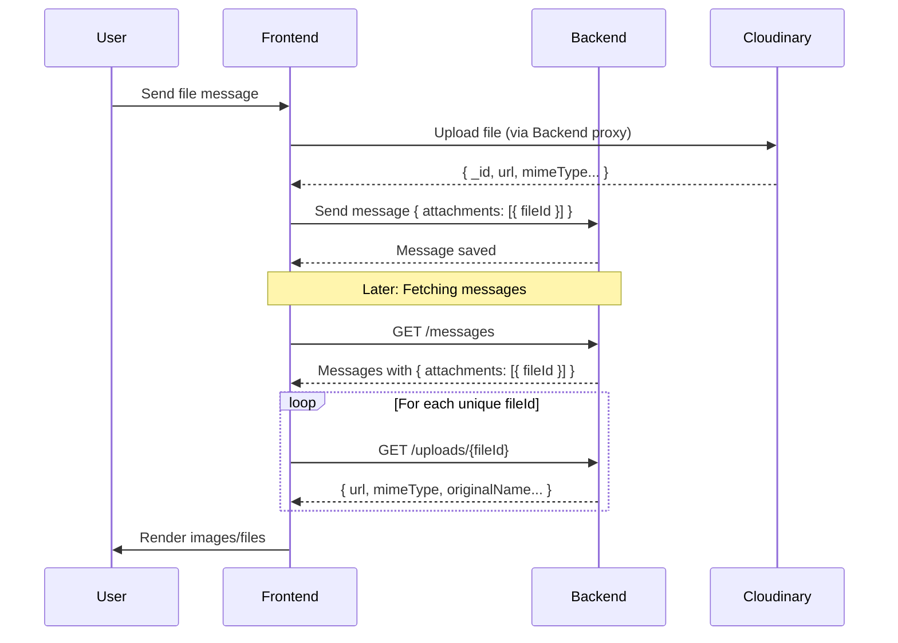

# Chat File Management System - Review & Recommendations

## Executive Summary

The current chat file management system has **significant inefficiencies** that impact performance and user experience. The primary issues stem from the backend not populating file details in message responses, requiring N+1 API calls to resolve attachments.

---

## Current Architecture



---

## Current Inefficiencies

### 1. **N+1 Query Problem** (Critical)

| Impact      | High                                                                             |
| ----------- | -------------------------------------------------------------------------------- |
| **Issue**   | Each message with attachments requires additional API calls to resolve file URLs |
| **Current** | 1 call for messages + N calls for file details                                   |
| **Example** | 50 messages with 10 file messages = 11 API calls instead of 1                    |

### 2. **No Caching of File Details**

| Impact      | Medium                                            |
| ----------- | ------------------------------------------------- |
| **Issue**   | File details are fetched every time messages load |
| **Current** | Same fileId fetched repeatedly across sessions    |
| **Cost**    | Wasted bandwidth and slower rendering             |

### 3. **Blocking Resolution**

| Impact      | Medium                                                         |
| ----------- | -------------------------------------------------------------- |
| **Issue**   | `getMessages` must await ALL file resolutions before returning |
| **Current** | `await Promise.all(filePromises)` blocks entire response       |
| **Effect**  | Slow initial message load for file-heavy conversations         |

### 4. **Upload Response Not Fully Utilized**

| Impact      | Low                                                                              |
| ----------- | -------------------------------------------------------------------------------- |
| **Issue**   | Upload returns `{ _id, url, mimeType }` but we only send `{ fileId }` in message |
| **Current** | Discarding information that must be re-fetched later                             |

---

## Frontend-Only Improvements

These can be implemented without any backend changes.

### 1. **Cache File Details in React Query**

```typescript
// Create a dedicated hook for file resolution
export function useFileDetails(fileId: string | undefined) {
  return useQuery({
    queryKey: ["file", fileId],
    queryFn: () => getFileById(fileId!),
    enabled: !!fileId,
    staleTime: Infinity, // Files don't change
    gcTime: 24 * 60 * 60 * 1000, // Keep in cache for 24 hours
  });
}
```

**Benefits:**

- Files fetched once and cached permanently
- Returning to conversation = instant file display
- Works across browser refreshes with persisted cache

### 2. **Lazy/Progressive Attachment Resolution**

Instead of blocking on all file details, render messages immediately and resolve attachments in the background:

```typescript
// MessageHistory.tsx
const MessageAttachment = ({ attachment }) => {
  const { data: fileDetails, isLoading } = useFileDetails(attachment.fileId);

  if (isLoading) return <Skeleton className="h-32 w-32" />;

  if (fileDetails?.mimeType?.startsWith('image/')) {
    return ;
  }
  return <FileDownloadCard file={fileDetails} />;
};
```

**Benefits:**

- Instant message display
- Progressive image loading
- Better perceived performance

### 3. **Optimistic Attachment Display**

Use upload response data for immediate display after sending:

```typescript
// When sending a message with attachment
const uploadResult = await uploadFile(formData);
const optimisticMessage = {
  ...message,
  attachments: [
    {
      fileId: uploadResult.data._id,
      url: uploadResult.data.url, // Use this immediately!
      mimeType: uploadResult.data.mimeType,
      originalName: uploadResult.data.originalName,
      size: uploadResult.data.size,
    },
  ],
};
```

**Benefits:**

- Sender sees file immediately after upload
- No need to re-fetch what we already have

### 4. **Batch File Resolution with Deduplication**

Improve the current parallel fetch with better deduplication:

```typescript
// Global pending requests map to avoid duplicate fetches
const pendingRequests = new Map<string, Promise<FileDetails>>();

async function getFileByIdCached(fileId: string) {
  if (pendingRequests.has(fileId)) {
    return pendingRequests.get(fileId);
  }

  const promise = getFileById(fileId);
  pendingRequests.set(fileId, promise);
  const result = await promise;
  pendingRequests.delete(fileId);
  return result;
}
```

---

## Backend Recommendations

These require backend team involvement.

### 1. **Populate Attachments in Message Response** (High Priority)

The backend should populate file details when returning messages:

```json
// Current response (inefficient)
{
  "attachments": [{ "fileId": "abc123" }]
}

// Recommended response
{
  "attachments": [{
    "fileId": "abc123",
    "url": "https://...",
    "mimeType": "image/png",
    "originalName": "photo.png",
    "size": 58827
  }]
}
```

**Implementation:** Add `.populate('attachments.fileId')` or equivalent join in the messages query.

**Impact:** Eliminates N+1 problem entirely. 1 API call returns everything.

### 2. **Store Full Attachment Data in Message Document**

Alternative to populate: store file details directly in the message:

```javascript
// When creating message
const message = {
  type: "file",
  attachments: [
    {
      fileId: uploadId,
      url: file.url, // Copy from file document
      mimeType: file.mimeType,
      originalName: file.originalName,
      size: file.size,
    },
  ],
};
```

**Pros:**

- Fastest read performance
- No joins needed
- Works with any database

**Cons:**

- Denormalized data
- Won't update if file URL changes (usually not an issue with Cloudinary)

### 3. **Batch File Details Endpoint**

Add an endpoint to fetch multiple files at once:

```
POST /api/v1/uploads/batch
Body: { fileIds: ["abc", "def", "ghi"] }
Response: { files: [ {...}, {...}, {...} ] }
```

**Benefits:**

- Single request for multiple files
- Better than N individual requests
- Useful if populate isn't possible

### 4. **WebSocket File Resolution**

For real-time messages, emit full file details:

```javascript
// Backend socket event
socket.emit("chat:message", {
  conversationId,
  data: {
    ...message,
    attachments: await resolveAttachments(message.attachments),
  },
});
```

---

## Recommended Implementation Priority

| Priority | Change                                    | Type     | Effort | Impact                       |
| -------- | ----------------------------------------- | -------- | ------ | ---------------------------- |
| 🔴 **1** | Backend: Populate attachments in messages | Backend  | Medium | **High** - Eliminates N+1    |
| 🟠 **2** | Frontend: Cache file details              | Frontend | Low    | Medium - Faster repeat views |
| 🟡 **3** | Frontend: Lazy attachment resolution      | Frontend | Medium | Medium - Better UX           |
| 🟢 **4** | Frontend: Optimistic display              | Frontend | Low    | Low - Better send experience |
| ⚪ **5** | Backend: Batch endpoint                   | Backend  | Low    | Low - Fallback option        |

---

## Quick Wins (Can Implement Today)

1. **Add React Query caching** for file details with `staleTime: Infinity`
2. **Use upload response** for optimistic display when sending
3. **Remove the debug log** we added earlier

---

## Conclusion

The root cause of inefficiency is **lack of data population on the backend**. While frontend improvements can mitigate the issue, the optimal solution is having the backend return complete attachment data in message responses.

**Short-term:** Implement frontend caching and lazy loading
**Long-term:** Request backend team to populate attachments in messages
